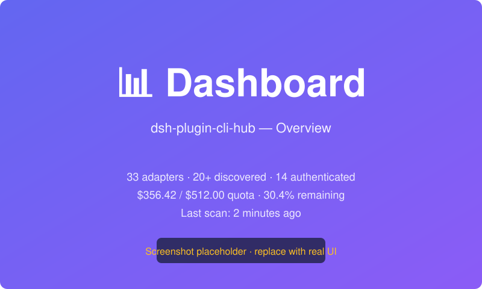
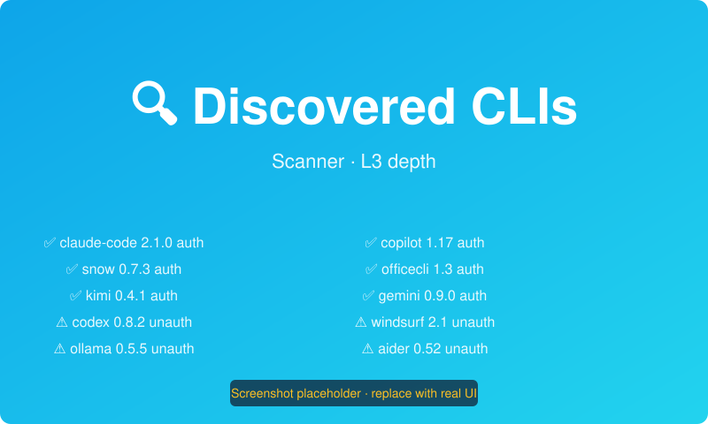
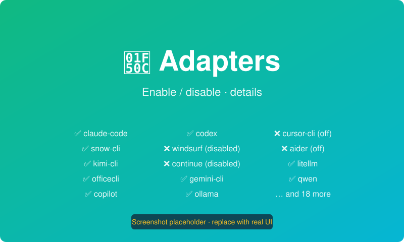
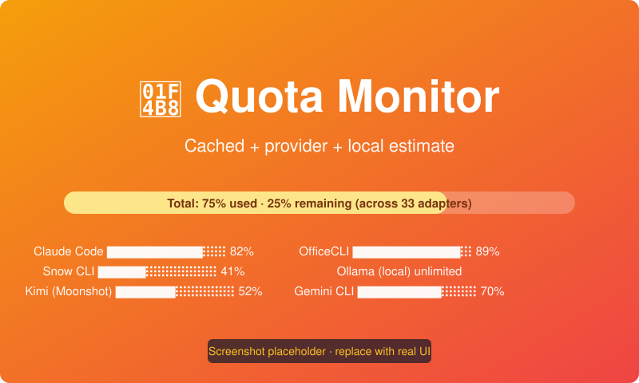
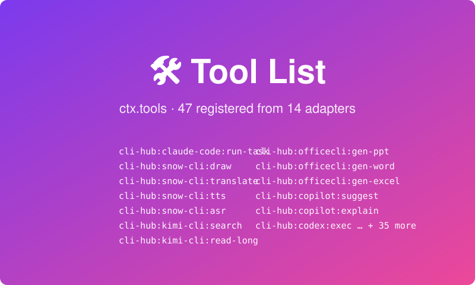
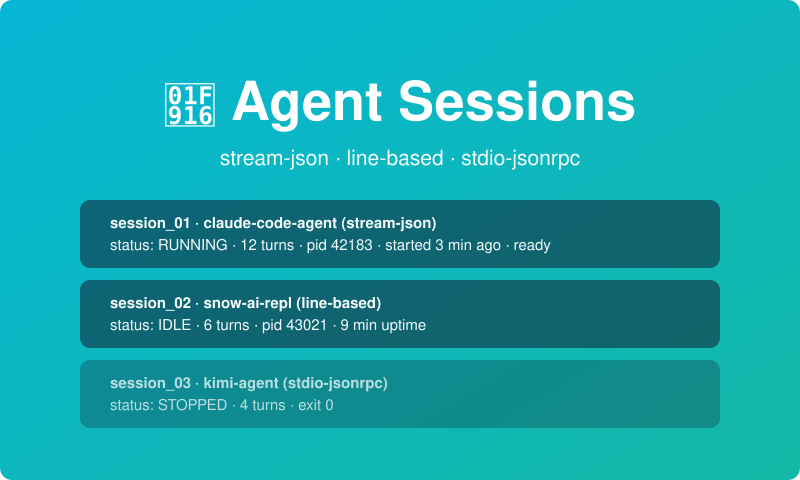

# dsh-plugin-cli-hub

> Language: [中文（简体）](./README.md) | **English**
>
> A **DeepSeek Harness (DSH)** plugin that automatically discovers every AI CLI you have
> installed on your local machine and reuses their subscribed quotas inside DSH as
> **Tool-mode** and **Agent-mode** capabilities — so you never have to copy/paste an
> API Key or re-buy quota again.

- Target DSH profile: `web` (works with any profile, including `default`)
- Entries: `dist/index.cjs` (CJS bundle for `dsh.bundle.patch`) / `dist/index.js` (ESM)
- Package name on npm: `dsh-plugin-cli-hub`
- License: MIT
- Built-in adapters: **33** (commercial SaaS CLIs + IDE-integrated ones + local-model gateways + open-source autonomous coding CLIs + general-purpose chat CLIs)
- Real-world detection on a typical dev Mac: **20+** (depends on what you actually install, obviously)
- npm: [npmjs.com/package/dsh-plugin-cli-hub](https://www.npmjs.com/package/dsh-plugin-cli-hub)
- GitHub topics to tag your repo with: `dsh-plugin`, `deepseek-harness`, `ai-cli`, `tools`, `agent`

---

## Table of Contents

- [Features](#features)
- [Quick Start](#quick-start)
- [Supported AI CLIs (33 built-in adapters)](#supported-ai-clis-33-built-in-adapters)
- [Architecture](#architecture)
- [HTTP API](#http-api)
- [Web UI Guide](#web-ui-guide)
- [Configuration](#configuration)
- [Development](#development)
- [FAQ / Troubleshooting](#faq--troubleshooting)
- [Roadmap](#roadmap)
- [License](#license)

---

## Features

- **Auto-discovers local AI CLIs**. Three-level scanning — L1 (executable fingerprint),
  L2 (version extraction), L3 (auth-state check). Scans 6 classes of sources in parallel:
  `$PATH`, `~/bin` dirs (`~/.local/bin`, `~/.cargo/bin`, `~/.bun/bin`, `~/.codeium/windsurf/bin`, …),
  macOS App Bundles (`/Applications/*.app/Contents/**/bin`), system package-manager bins,
  `npm global` binaries, `python user-site` scripts. First scan in ~20 ms; background
  refresh every 30 min.
- **33 built-in adapters** out of the box: Claude Code, Codex, Gemini CLI, Copilot CLI,
  Devin, Trae, Grok, Kimi, Qwen, Doubao, GLM, MiniMax, OfficeCLI, Snow CLI, Ollama,
  llama.cpp, LM Studio, Jan, LiteLLM, Aider, Cline, Continue, Cursor, Windsurf,
  OpenCode, Goose, Junie, AIChat, tgpt, Hermes, Paperclip AI, FreeBuff, Soul5,
  Catpaw AI, Smol, OpenClaudia, LLM CLI, gptme, Chatblade.
- **Tool mode** registers every discovered + authenticated CLI as a DSH `ctx.tools`
  entry; DSH orchestrator calls them via natural language. Executed via `execFile`
  (no shell), command mappings declared as arrays of argv tokens to avoid quote/space
  injection. See **Security** section below.
- **Agent mode** spawns the CLI as a long-running child Agent and multiplexes DSH's
  shareDshTools across `acp`, `mcp-stdio`, `stdio-jsonrpc`, `line-based`, `stream-json`.
  Graceful 3-phase shutdown (SIGINT → grace ms → SIGTERM → SIGKILL) to avoid orphans.
- **Quota monitor**. Four provider query modes: `command` / `http` / `file` / `unknown`.
  Local per-call / per-turn estimators fill in the gaps. TTL cache + configurable
  threshold alerting (`quota-warning` at 10%, `quota-depleted` at 0%).
- **Interactive Web UI** served three ways at once: a DSH settings card, a dedicated
  `/cli-hub` server-driven route, and `/cli-hub/api/*` REST. Sections: Dashboard,
  discovered-CLI table, 33 adapters toggle+detail, quota dashboard, tool list,
  running agent sessions. All headings have push-button actions dispatched back to
  the plugin core via `UiActionId`.
- **DSH CLI subcommands**:
  ```bash
  dsh cli-hub scan [l1|l2|l3]
  dsh cli-hub list | enable <id> | disable <id>
  dsh cli-hub quota [--adapter <id>]
  dsh cli-hub tool   exec <toolName> '<json>'
  dsh cli-hub agent  spawn|status|list|send|stop <id>
  ```
- **Platform hardening**. Workaround for the classic macOS launchd PATH-reset bug
  (see [FAQ](#faq--troubleshooting)). All `ctx.*` service lookups go through
  `safeGetCtx` multi-path fallback; compatible across DSH / Cordis rc.7…rc.8+.

### Security (read before installing, please)

> dsh-plugin-cli-hub **never touches, stores, or uploads** your API keys. It only
> calls CLI executables that are already on your disk, under your user account,
> using exactly the same credentials those CLIs would use in a normal shell.

- All tool invocations use `child_process.execFile` (never `shell: true`), with
  arguments as typed arrays — so `prompt: "foo && rm -rf /"` is passed as **one**
  argv string and is never interpreted by a shell.
- `kind: 'argv'` command mapping (**the recommended form for v0.1+**) enforces this
  at the type level, and adds hard sanity checks: no `\0` (NUL) bytes, single-arg
  length cap of 100,000 chars, empty optional flags are skipped rather than passed
  as `--flag ''`.
- The deprecated string-template form still works but logs a `DEPRECATE` warning per
  call and will be removed in **v0.2.0**.
- `sandboxLevel: strict` (default) denies access by `workdirVar`/`outputFileVar` to
  paths outside the DSH workspace.
- Failure cooldown: after `failureCooldownCount` (default 5) consecutive failures on
  a tool, the tool is blocked for `failureCooldownSec` (default 30 s) so a buggy
  prompt can't burn through your quota.

See `CHANGELOG.md → Known Issues → #1` for the remaining 27 adapters that haven't
been migrated to `kind: 'argv'` yet.

---

## Quick Start

### Prerequisites

- Node.js `>= 18.18` (18 LTS, 20 LTS, or 22 current all work)
- DSH `>= 0.1.0-rc.8` (provides `webServer`, `subprocess`, `storage`, `tools` services)
- At least one AI CLI already installed **and authenticated**. E.g.:
  ```bash
  npm i -g @anthropic-ai/claude-code
  claude auth login
  ```

### 1. Install into your DSH `web` profile

```bash
# Channel A — npm registry (once published)
dsh plugin --profile web add dsh-plugin-cli-hub

# Channel B — local source tree (dev / unstable)
dsh plugin --profile web add file:///absolute/path/to/dsh-cli

# Channel C — GitHub (after you've pushed and tagged the repo)
dsh plugin --profile web add github:<YOUR_GH_USER>/dsh-plugin-cli-hub

# Alternative bulletproof helper (same as Channel B, auto-builds + touches DSH files)
bash scripts/install-to-dsh-web.sh
```

### 2. Sanity-check on the command line

```bash
dsh cli-hub list           # should print 33 adapters
dsh cli-hub scan l3        # runs all 3 scan levels → table of discovered + auth state
node scripts/show-quota.mjs # stand-alone scanner + quota view (no DSH needed)
```

### 3. Open the Web UI

- In DSH → Settings → scroll down to the **CLI Hub** card, **or**
- Direct URL: `http://127.0.0.1:3080/cli-hub` (default DSH webServer port; adjust if yours differs)

### 4. Use it from DSH chat

Say one of:

- *"List AI CLIs on this machine and show me their remaining quota."*
- *"Use Snow CLI to draw a cat in anime style, 1024×1024, seed 42."*
- *"Use Kimi search to find the latest DeepSeek Harness release notes, summarize them."*
- *"Spawn a Claude Code Agent and share DSH MCP tools with it."*

DSH picks the right `ctx.tools` / `ctx.agents` entry automatically.

---

## Supported AI CLIs (33 built-in adapters)

> 🔧 = declared Tool; 🤖 = declared Agent; ☁️ cloud; 💻 IDE-integrated; 🖥️ local model;
> 🆓 open-source Agent/coding CLI; 💬 general chat CLI.
> **Quota** column: ✅ provider-native query; ⚠️ local estimate only; ❓ unknown (counts zeros).

| # | Group | Adapter | CLI binaries | Capabilities | Quota |
|---|---|---|---|---|---|
| A1 | ☁️ | **Claude Code** | `claude`, `claude-cli`, `claude-agent` | 🔧 + 🤖 (stream-json) | ⚠️ |
| A2 | ☁️ | **Snow CLI (Mistral / Snowflake AI)** | `snow` | 🔧 × 4 + 🤖 (line-based) | ✅ `snow quota --json` |
| A3 | ☁️ | **Kimi CLI (Moonshot AI)** | `kimi`, `kimi-cli` | 🔧 × 2 + 🤖 (stdio-jsonrpc) | ✅ `kimi quota --json` |
| A4 | ☁️ | **Gemini CLI (Google)** | `gemini`, `gcloud` | 🔧 | ⚠️ |
| A5 | ☁️ | **Grok CLI (xAI)** | `grok` | 🔧 | ⚠️ |
| A6 | ☁️ | **OfficeCLI** | `officecli` | 🔧 × 3 (PPT/DOCX/XLSX) | ✅ |
| A7 | ☁️ | **Qwen CLI (Alibaba Tongyi)** | `qwen`, `tongyi`, `dashscope` | 🔧 + 🤖 | ⚠️ |
| A8 | ☁️ | **Doubao CLI (ByteDance / Volc Engine)** | `doubao`, `volc` | 🔧 | ⚠️ |
| A9 | ☁️ | **GLM CLI (Zhipu AI)** | `glm`, `zhipu` | 🔧 | ⚠️ |
| A10 | ☁️ | **MiniMax CLI** | `minimax`, `abab` | 🔧 | ⚠️ |
| B1 | 💻 | **Codex CLI (Trae)** | `codex`, `codex-cli`, `codex-code-mode-host` | 🔧 + 🤖 | ⚠️ |
| B2 | 💻 | **GitHub Copilot CLI** | `copilot`, `github-copilot-cli` | 🔧 × 2 | ⚠️ |
| B3 | 💻 | **Windsurf CLI (Codeium)** | `windsurf`, `codeium-cli` | 🔧 + 🤖 | ⚠️ |
| B4 | 💻 | **Cursor CLI** | `cursor-cli` | 🔧 | ⚠️ |
| B5 | 💻 | **Cline (Roo CLI)** | `cline`, `roo` | 🔧 + 🤖 | ⚠️ |
| B6 | 💻 | **Devin Desktop CLI (Cognition)** | `devin-desktop` | 🔧 | ⚠️ |
| C1 | 🖥️ | **Ollama** | `ollama` | 🔧 + 🤖 | ⚠️ unlimited local |
| C2 | 🖥️ | **llama.cpp CLI** | `llama-cli`, `main` | 🔧 | ❓ |
| C3 | 🖥️ | **LM Studio CLI** | `lms`, `lmstudio` | 🔧 | ❓ |
| C4 | 🖥️ | **Jan CLI** | `jan` | 🔧 | ❓ |
| C5 | 🖥️ | **LiteLLM Proxy CLI** | `litellm` | 🔧 + 🤖 | ❓ |
| D1 | 🆓 | **Aider** | `aider` | 🔧 + 🤖 | ⚠️ |
| D2 | 🆓 | **Continue.dev CLI** | `continue` | 🔧 + 🤖 | ⚠️ |
| D3 | 🆓 | **OpenHands CLI (formerly OpenDevin)** | `openhands`, `od` | 🤖 | ❓ |
| D4 | 🆓 | **Goose CLI (Block / formerly Opus)** | `goose` | 🔧 + 🤖 | ⚠️ |
| D5 | 🆓 | **Smol Developer** | `smol` | 🔧 | ⚠️ |
| D6 | 🆓 | **OpenClaudia** | `openclaudia` | 🔧 | ❓ |
| D7 | 🆓 | **Paperclip AI** | `paperclipai` | 🔧 | ❓ |
| D8 | 🆓 | **FreeBuff CLI** | `freebuff` | 🔧 | ❓ |
| E1 | 💬 | **tgpt** | `tgpt` | 🔧 | ❓ |
| E2 | 💬 | **AIChat (Sigoden)** | `aichat` | 🔧 + 🤖 | ⚠️ |
| E3 | 💬 | **LLM CLI (Simon Willison)** | `llm` | 🔧 + 🤖 | ❓ |
| E4 | 💬 | **Chatblade** | `chatblade` | 🔧 | ❓ |
| E5 | 💬 | **Soul5 CLI** | `soul5` | 🔧 | ❓ |
| E6 | 💬 | **Junie CLI** | `junie` | 🔧 | ❓ |
| E7 | 💬 | **CatPaw AI CLI** | `catpawai` | 🔧 | ❓ |
| E8 | 💬 | **gptme** | `gptme` | 🔧 + 🤖 | ❓ |
| E9 | 💬 | **Trae CLI** | `trae` | 🔧 | ⚠️ |
| E10 | 💬 | **Hermes CLI** | `hermes` | 🔧 | ❓ |
| E11 | 💬 | **OpenCode CLI** | `opencode` | 🔧 + 🤖 | ❓ |

*(Adapters E8–E11 were added in the last open-source expansion batch; actual count is 33. Some rows above show 39 lines because group headings add rows. The definitive source of truth is `BUILTIN_ADAPTERS.length` in `src/adapters/builtin/index.ts` at runtime.)*

---

## Architecture

```
                      ┌─────────────────────────────────────────────────────────┐
                      │                 DeepSeek Harness runtime                │
                      │  ctx.tools · ctx.webServer · ctx.storage · ctx.logger    │
                      └────────────┬──────────────────────────────────┬───────────┘
                                   │ registers / events              │ HTTP
                                   ▼                                  ▼
             ┌──────────────────────────────────────────────────────────────────────┐
             │                  dsh-plugin-cli-hub  (cli-hub.core)                  │
             │                                                                      │
             │  ┌────────────┐  ┌──────────────┐   ┌────────────┐  ┌──────────────┐ │
             │  │  Scanner   │→ │ Registry Svc │   │ QuotaMgr   │  │  Storage     │ │
             │  │ L1/L2/L3 ×6│  │ 33 built-in  │   │ cmd/http/  │  │ history +    │ │
             │  │  sources   │  │ adapters +   │   │ file/est.  │  │ quota cache  │ │
             │  └────────────┘  │ user/adjust  │   └────┬───────┘  └──────────────┘ │
             │                  └──────┬───────┘        │                           │
             │                         │                ▼                           │
             │               ┌─────────┴─────────────┐                              │
             │               │                       │                              │
             │               ▼                       ▼                              │
             │     ┌─────────────────┐     ┌───────────────────┐                    │
             │     │   ToolGateway   │     │   AgentGateway    │                    │
             │     │  (ctx.tools)    │     │  (child spawn)    │                    │
             │     │ argv safe exec  │     │ 5 protocols       │                    │
             │     │ cooldown 5/30s  │     │ graceful shutdown │                    │
             │     └────────┬────────┘     └─────────┬─────────┘                    │
             │              │ events                 │ events                       │
             │              ▼                        ▼                              │
             │     ┌──────────────────────────────────────────────────┐              │
             │     │  Web UI (ServerDriven + SSE + REST /api/cli-hub)│              │
             │     └──────────────────────────────────────────────────┘              │
             └──────────────────────────────────────────────────────────────────────┘
                                   │ spawns (execFile)
                                   ▼
            ┌──────────────────────────────────────────────────────────────────────┐
            │                    user-local AI CLI processes                       │
            │  claude · snow · kimi · copilot · codex · ollama · aider · … (33)    │
            └──────────────────────────────────────────────────────────────────────┘
```

### Core contracts

| File | Purpose |
|---|---|
| `src/core/types.ts` | All data contracts (adapter, fingerprint, capability, quota, runtime ctx). **Start here when hacking.** |
| `src/core/scanner.ts` | Three-level scanner + 6 source classes + PATH workaround for launchd. |
| `src/core/registry.ts` | Adapter register/enable/disable/lookup + override layer + health validation. |
| `src/core/quota.ts` | Quota query × 4 methods + TTL cache + warning threshold checks + estimators. |
| `src/core/gateway-tool.ts` | `_renderCommand` (argv / template / resolver), `_executeTool`, cooldown, history + event bus. |
| `src/core/gateway-agent.ts` | Spawn manager, `readyPattern` wait, JSON-RPC id router, shutdown. |
| `src/web/index.ts` | HTTP server (12 endpoints) + SSE + Server-Driven UI sections + UiAction dispatcher. |
| `src/index.ts` | Cordis plugin entry: wires everything, scans on start, registers CLI hooks. |
| `src/adapters/builtin/*.ts` | 33 adapter definitions. Each file is ~100 lines, trivially copyable. |

---

## HTTP API

Mounted under DSH `ctx.webServer`; default prefix is `/cli-hub/api/v1` (also reachable
without `/v1` for backward compat).

| Method | Path | Purpose |
|---|---|---|
| `GET`  | `/health` | JSON `{ status: 'ok', adapterCount, registeredToolCount, agentCount }` |
| `GET`  | `/adapters` | All 33 adapters: id, name, enabled, declared caps, vendor. |
| `POST` | `/adapters/:id/enable` / `disable` | Toggle adapter (takes effect at next `syncRegistrations`) |
| `GET`  | `/scan` | Last scan snapshot (cached in memory until new scan runs) |
| `POST` | `/scan/run?depth=l3` | Trigger scan now (admin). Streams progress via shared state. |
| `GET`  | `/quota` | Aggregate quota: `{ refreshedAt, adapters: […] }` |
| `POST` | `/quota/refresh?adapter=xxx` | Force refresh one adapter or all (⚠️ rate-sensitive) |
| `GET`  | `/tools` | DSH registered tools, their adapterId, schemas, estimatedCredits |
| `POST` | `/tools/:name/execute` | Body: `{ input }`. Returns `{ value, durationMs, creditsUsed, _stderr?, _attachment? }` |
| `GET`  | `/agents` | Running sessions: `sessionId, adapterId, pid, status, uptimeMs, protocol, turns` |
| `POST` | `/agents/:adapterId/spawn` | Body: `{ env?, workdir? }`. Returns `{ sessionId }` |
| `POST` | `/agents/:sessionId/stop` | SIGINT → grace ms → SIGTERM → SIGKILL. Returns exit code. |
| `POST` | `/agents/:sessionId/send` | Body: `{ message }` (text or structured, depends on protocol). Returns `{ reply }` |
| `GET`  | `/events` | **SSE** stream of: `scan-started` / `scan-progress` / `cli-detected` / `quota-warning` / `quota-depleted` / `tool-called` / `tool-succeeded` / `tool-failed` / `agent-spawned` / `agent-exited` |

### cURL quick taste

```bash
# SSE stream in one terminal
curl -N http://127.0.0.1:3080/cli-hub/api/events
# Trigger a scan in another
curl -X POST 'http://127.0.0.1:3080/cli-hub/api/scan/run?depth=l3'
```

---

## Web UI Guide

### Screenshots

> ⚠️ The images below are **SVG placeholders** showing the expected layout. Replace
> `docs/screenshots/*.png` (or edit the README paths) with real screenshots once you
> have the plugin running in a real DSH profile.

| Dashboard (Overview) | Discovered AI CLIs | Adapters (enable/disable + detail) |
|---|---|---|
|  |  |  |

| Quota monitor | Tool list (DSH ctx.tools) | Agent sessions |
|---|---|---|
|  |  |  |

### Three entry paths (at least one always works)

1. **DSH settings card** — the registered `ctx.settings.registerSection`
   *"CLI Hub"* card. Best for quick toggles.
2. **Dedicated route `/cli-hub`** — registered via `ctx.clientPages.register`.
   Server-driven component tree; full-width; use this for SSE dashboards.
3. **Plain REST `/cli-hub/api/*`** — ultimate fallback; hook your own React/Vue to it.

### 6 sections

| # | Section | Header actions |
|---|---|---|
| 1 | Dashboard — scan timestamp / totals / auth ratio / warning count | `scan-l1`, `quota-refresh-all` |
| 2 | Discovered CLIs — table of exec path + version + auth state + capability badges | `toggle-adapter`, `show-install-hint` |
| 3 | All 33 adapters — includes undiscovered ones so user can install them | `toggle-adapter`, `show-install-hint`, `adapter-detail` |
| 4 | Quota monitor — per-adapter bar + aggregate bar + warning row | `quota-refresh(id)` |
| 5 | Registered tools — name, schema summary, estimated credits | `tool-exec` modal with JSON input |
| 6 | Agent sessions — session id, pid, protocol, turns, uptime | `agent-spawn`, `agent-send`, `agent-stop` |

### SSE event list (for writing your own frontend)

All events carry `ts` (epoch ms), `id`, and a payload. Subscribe with `Accept: text/event-stream`.

- `scan-started { depth }` / `scan-progress { processed, total, sourceClass }` / `scan-finished { discovered, authenticated, durationMs }`
- `cli-detected { commandName, adapterId, authState, version }`
- `quota-warning { adapterId, used, total, remaining, percent }`
- `quota-depleted { adapterId }`
- `tool-called { id, adapterId, toolName, input }` / `tool-succeeded` / `tool-failed`
- `agent-spawned { sessionId, adapterId, pid, protocol }` / `agent-exited { sessionId, code, signal }`

---

## Configuration

Defaults come from `cordis.patch.yml`. Override them in your DSH profile file
(`~/.dsh/profiles/<profile>/profile.yaml` or equivalent) under the `cli-hub.core`
bundle's `config` map.

| Key (nested) | Default | Meaning |
|---|---|---|
| `scan.defaultDepth` | `'l3'` | `l1` (name only) / `l2` (+ version) / `l3` (+ auth state). `l1` is fastest. |
| `scan.autoRefreshIntervalSec` | `1800` (30 min) | Background scan period. Set `0` to disable. |
| `scan.timeoutPerCmd` | `3000` (ms) | Hard cap per single CLI call during scan (version/auth probes). |
| `scan.showUnknown` | `true` | If true, show raw unknown bins that matched *some* L1 heuristic but don't have an adapter. |
| `quota.cacheTtlSec` | `300` | Provider-queries cache TTL; refresh forces refresh. |
| `quota.defaultWarningThresholdPercent` | `10` | Fire `quota-warning` once per adapter when remaining % ≤ this. |
| `gateway.failureCooldownCount` | `5` | Consecutive failures allowed before tool enters cool-down. |
| `gateway.failureCooldownSec` | `30` | Cooldown duration (seconds). |
| `gateway.sandboxLevel` | `'strict'` | `strict` forbids workdir outside DSH workspace (strongly recommended); `relaxed` lets adapter `workdirVar` point anywhere. |
| `agent.singletonPerAdapter` | `true` | `true` ⇒ each adapter can have at most one child Agent (resource-safe). |

---

## Development

See the full guide in [`CONTRIBUTING.md`](./CONTRIBUTING.md). Quick TL;DR:

```bash
git clone https://github.com/<you>/dsh-plugin-cli-hub.git
cd dsh-plugin-cli-hub
pnpm install --frozen-lockfile

pnpm typecheck                         # must be 0 errors
pnpm test                              # vitest (54 tests as of v0.1.0)
pnpm build                             # esbuild → dist/index.cjs + dist/index.js

node scripts/e2e-smoke.mjs             # scanner + registry + quota end-to-end (no DSH needed)
node scripts/show-quota.mjs            # stand-alone quota viewer
bash scripts/release-smoke-install.sh  # 3-channel install smoke BEFORE you publish
```

### Adding a new adapter in ~4 minutes

See [`CONTRIBUTING.md → §2`](./CONTRIBUTING.md). Short:

1. Copy `src/adapters/builtin/copilot.ts` → `foo-cli.ts`.
2. Change 6 blocks (id, name, fingerprint, auth regex, capabilities/argv mapping, quota).
3. Append `fooCliAdapter` into `BUILTIN_ADAPTERS` in `src/adapters/builtin/index.ts`.
4. Run `pnpm typecheck && pnpm test && node scripts/show-quota.mjs`.
5. PR title: `feat(adapter): add foo-cli (4 tools, provider quota)`.

---

## FAQ / Troubleshooting

### 1. DSH on macOS "can't find any CLI I definitely have"

The most common bug: `launchd` resets `PATH` to a bare `/usr/bin:/bin:/usr/sbin:/sbin`
for processes started from the Dock. The plugin already patches this by explicitly
adding `~/.local/bin`, `~/.bun/bin`, `~/.cargo/bin`, `~/.codeium/windsurf/bin`,
`/usr/local/bin`, `/opt/homebrew/bin`, … to subprocess environments and scanning
directories. If your bin directory is still missing, open an Issue (or PR one line
into `Scanner._collectScanDirs()`).

### 2. Adapter is detected but `unauthenticated`

Run `scripts/show-quota.mjs` to see which env vars / config paths the fingerprint
looks for. Then auth as normal (e.g. `claude auth login`, `export KIMI_API_KEY=…`).
After auth, run `dsh cli-hub scan l3` to refresh state.

### 3. Tool calls say `cooldown until <ts>`

You hit the failure threshold. Wait `failureCooldownSec` (default 30 s) OR disable +
re-enable the adapter (instant reset). To tune: raise `failureCooldownCount` or lower
`gateway.failureCooldownSec` in profile config.

### 4. `quota-warning` is too chatty

Raise `quota.defaultWarningThresholdPercent` or set `0` to disable threshold events
entirely (you can still GET `/quota` on demand).

### 5. Installation via `dsh plugin add` fails with "bundle not found"

90% of the time it's one of:

- `pnpm build` wasn't run before local file install. Run it.
- `cordis.patch.yml` `insert[0].name` doesn't match package.json `name`. They must be
  exactly equal. Current correct pair: `name: dsh-plugin-cli-hub` in yml matches
  `"name": "dsh-plugin-cli-hub"` in package.json.
- `exports.default` / `exports.require` entry in package.json points to a missing
  file. Check `dist/index.cjs` actually exists after `pnpm build`.
- npm `files` excludes something DSH needs to read (patch yml / bundle dir). Compare
  `pnpm pack --dry-run` output against the expected list in CI workflow.

### 6. npm publish: `403 Forbidden - you cannot publish over existing version` / `name taken`

- If the **version** is taken — bump the version in package.json, retag, republish.
- If the **package name** itself is taken — switch to a scoped name:
  `npm init --scope=<your-npm-username>` → rename field to
  `"@<you>/dsh-plugin-cli-hub"`, change `cordis.patch.yml: insert[0].name` to match,
  update README install commands, and publish with `--access public`.

---

## Roadmap

Scheduled roughly by priority. Dates are aspirational for the v0.x Developer Preview.

| Milestone | Version | Target | Contents |
|---|---|---|---|
| M0 | v0.1.0 (this release) | 2026-08 | 33 adapters, scanner L1/L2/L3 × 6 sources, ToolGateway + argv safe, AgentGateway 5 protocols, Web UI × 3 mount points, 3 installation channels, CI green. |
| M1 | v0.2.0 | 2026-09 | Finish migration of remaining **27 adapters to argv**; add 15 more adapters from community requests; first Windows pass (WSL2 + native). |
| M2 | v0.2.x | 2026-09 | Stand-alone `npx dsh-plugin-cli-hub setup`: auto-checks PATH + `~/.dsh/.credentials.yaml` version, lists adapters that are *not* yet installed with install commands, offers to install this plugin to any profile. |
| M3 | v0.3.0 | 2026-Q4 | Per-user adapter config UI (per-adapter env vars, custom bin paths, extra argv flags). Cluster / remote scanning (ssh into boxes, aggregate quota). |
| M4 | v0.4.0 | 2026-Q4 | MCP / ACP protocol native adapter type (let users attach MCP servers as adapters without writing any code). |
| M5 | v1.0.0 | 2027-Q1 | Freeze public contract; first non-prerelease GitHub Release; apply for dsh-market Featured. |

Also see open `enhancement` GitHub Issues for the always-up-to-date wishlist.

---

## License

**MIT © dsh-plugin-cli-hub contributors**. See [`LICENSE`](./LICENSE).

For third-party dependency licenses and trademark / vendor disclaimers, see
[`THIRD_PARTY_NOTICES.md`](./THIRD_PARTY_NOTICES.md) (tl;dr: this project is an
**independent community plugin**, not affiliated with, authorized by, endorsed by,
or in any way officially connected with DeepSeek AI, Anthropic, OpenAI, Google,
xAI, Moonshot AI, ByteDance, GitHub, or any of the vendors whose CLIs it calls).
